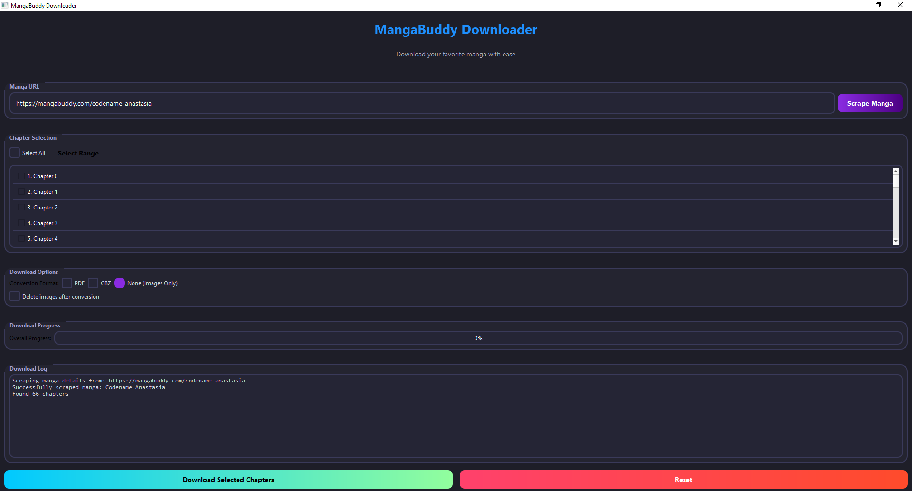

# MangaBuddy Downloader

A modular, threaded manga downloader for MangaBuddy with an interactive CLI and a sleek GUI. This powerful tool allows you to easily download your favorite manga series from MangaBuddy.com with high-speed parallel downloads and multiple output formats. Whether you prefer the command-line interface or the modern graphical user interface, this downloader provides a seamless experience for all your manga reading needs.

<p align="center">
  
</p>

## 🌟 Features

*   **Interactive CLI:** Easy-to-use command-line interface built with Rich and Typer
*   **Sleek GUI:** Modern PyQt6-based graphical user interface with dark theme
*   **Flexible Chapter Selection:** Download single chapters, a range of chapters, or all chapters
*   **Multiple Formats:** Convert downloaded chapters to PDF or CBZ, or keep images only
*   **Configurable Cleanup:** Option to automatically delete original images after conversion
*   **Parallel Downloads:** Multi-threaded chapter downloads with concurrent image downloads for speed
*   **Robust Error Handling:** Retry mechanisms and proper error messages for failed downloads
*   **Cloudflare Bypass:** Uses Playwright and cloudscraper to handle Cloudflare protection

## 🚀 Installation

1. **Clone the repository:**
    ```bash
    git clone https://github.com/Yui007/mangabuddy_downloader.git
    cd mangabuddy_downloader
    ```

2. **Install dependencies:**
    ```bash
    pip install -r requirements.txt
    ```

## 🎮 Usage

### CLI

Run the interactive CLI:

```bash
python main.py
```

Follow the on-screen prompts to:
1.  Enter the MangaBuddy URL for the manga you want to download
2.  Choose which chapters to download (single, range, or all)
3.  Select the conversion format (PDF, CBZ, or none)
4.  Decide whether to delete images after conversion

### GUI

Launch the sleek graphical interface:

```bash
python gui.py
```

The GUI provides all the same functionality as the CLI with a modern, user-friendly interface:
- Visual chapter selection with checkboxes
- One-click download buttons
- Real-time progress tracking
- Detailed download log

Downloads will be saved in the `downloads/` directory, organized by manga title and chapter.

## ⚙️ Configuration

You can adjust settings in `config.py`:

| Setting | Description | Default |
|---------|-------------|---------|
| `MAX_CHAPTER_THREADS` | Maximum number of chapters to download concurrently | 5 |
| `MAX_IMAGE_THREADS` | Maximum number of images to download concurrently within a chapter | 10 |
| `DOWNLOAD_PATH` | Base directory for downloads | `./downloads/` |
| `DELETE_IMAGES_AFTER_CONVERSION` | Default choice for deleting images after conversion | `False` |
| `RETRY_ATTEMPTS` | Number of times to retry a failed download | 3 |
| `PLAYWRIGHT_HEADLESS` | Run browser in headless mode | `True` |
| `PLAYWRIGHT_WAIT_AFTER_NAV` | Wait time after navigation (ms) | 500 |
| `PLAYWRIGHT_WARNING_BUTTON_TIMEOUT` | Timeout for age warning button (ms) | 5000 |
| `PLAYWRIGHT_WAIT_AFTER_WARNING_CLICK` | Wait time after clicking warning (ms) | 2000 |
| `PLAYWRIGHT_IMAGE_LOAD_WAIT` | Wait time for images to load (ms) | 5000 |

## 📁 Project Structure

```
mangabuddy_downloader/
├── main.py          # Interactive CLI entry point
├── gui.py           # PyQt6 GUI module
├── downloader/
│   ├── __init__.py
│   ├── scraper.py   # Scrapes manga title and chapter list using Playwright
│   ├── download.py  # Handles threaded chapter and image downloads using cloudscraper
│   ├── converter.py # Converts images to PDF or CBZ
│   └── utils.py     # Helper functions
├── config.py        # Configuration settings
├── requirements.txt # Python dependencies
```


## 📄 License

This project is licensed under the MIT License - see the [LICENSE](LICENSE) file for details.